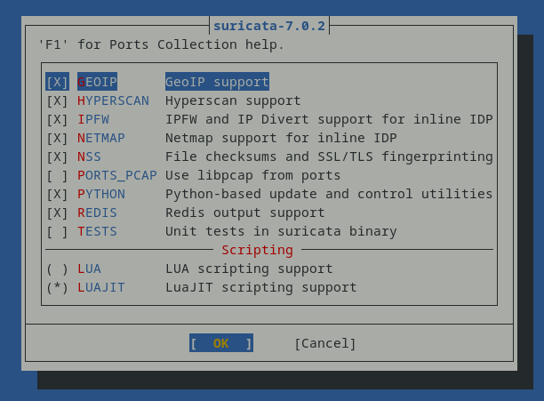

You may want to run the default Suricata pkg from the FreeBSD repos, which is the easiest option, by downloading the Suricata package and dependancies to the packages directory:

```bash
root@freebsd02:~ #pkg-fetch -d -o /usr/src/tools/tools/nanobsd/nanoids/packages suricata-7.0.6
root@freebsd02:~ #mv /usr/src/tools/tools/nanobsd/nanoids/packages/All* /usr/src/tools/tools/nanobsd/nanoids/packages/
root@freebsd02:~ #rm -r /usr/src/tools/tools/nanobsd/nanoids/packages/All
```

If you want to run enable Lua (detection and/or output), dataset, datarep or geoip functionality then you must compile Suricata from source which can be a little more tricky:

```bash
root@freebsd02:~ # cd /usr/ports/security/suricata/
root@freebsd02:~ # make config
```
Enable the features you want, as any example I enabled geoip and Lua and left the rest as defaults

[back](./)
